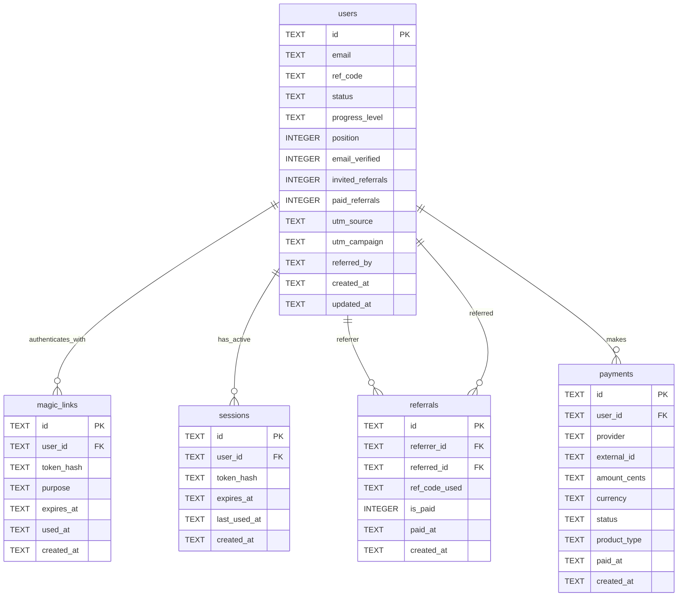

# Waitlist Database Schema

## Упрощенная схема для вейтлиста

### 🎯 Основные функции:
- **Сбор email** для вейтлиста
- **Реферальная программа** с кодами
- **Password-less аутентификация** через magic links
- **Сессии** для поддержания залогиненности
- **Отслеживание платежей** для early access

### 📊 Описание таблиц:

**users** - основная таблица пользователей
- `status`: 'waitlist' | 'early_access' | 'banned'
- `progress_level`: 'wl_joined' | 'referral_milestone' | 'early_access_unlocked'
- `position`: позиция в очереди вейтлиста
- `email_verified`: 0/1 (подтвержден ли email)
- `invited_referrals`: количество приглашенных (подписавшихся по ссылке)
- `paid_referrals`: количество оплативших EA среди приглашенных
- `referred_by`: ID пользователя-реферера

**magic_links** - для passwordless аутентификации
- `purpose`: 'login' | 'email_verification'
- `token_hash`: хеш токена (для безопасности)

**sessions** - активные сессии пользователей
- `token_hash`: хеш сессионного токена
- `last_used_at`: для автоматического истечения

**referrals** - реферральные связи
- `is_paid`: 0/1 (оплатил ли приглашенный EA)
- `paid_at`: когда была зафиксирована оплата
- `ref_code_used`: какой реф-код использовался

**payments** - отслеживание оплат EA
- `status`: 'pending' | 'completed' | 'failed' | 'refunded'
- `product_type`: 'early_access' | 'priority_boost'

## 🚀 Логика работы:

### Реферальная система:
1. **Генерация ссылки**: `https://skygen.ai/wl?ref=<ref_code>`
2. **Отслеживание**: cookie сохраняет ref_code → при регистрации пишем `referred_by`
3. **Подсчет invited**: +1 к `invited_referrals` у реферера
4. **Подсчет paid**: при webhook о покупке EA → +1 к `paid_referrals` у реферера

### Прогресс-бар (3 уровня):
- **WL Joined** - сразу после регистрации
- **Referral Milestone** - после 3+ paid referrals (например)
- **Early Access Unlocked** - после покупки EA

### Email уведомления:
- При каждом paid referral отправляем email реферреру
- "Поздравляем! +1 оплаченный реферал. Всего: X"
